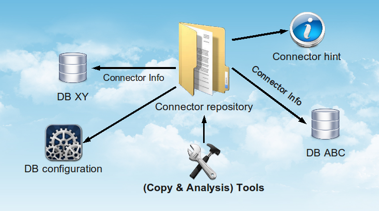

# guttenbase architecture

The following image depicts the basic architecture of the guttenbase framework:

Everything is grouped around the _connector repository_ containing all informations about the configured data bases.

* Data base specific informations are contained in [Configurations](configuration.md)
* [Hints may influence the migration process in various ways. E.g., by filtering the list of tables to be copied.](hints.md)
* [Tools use the connector repository and the hints to do their work](tools.md)

