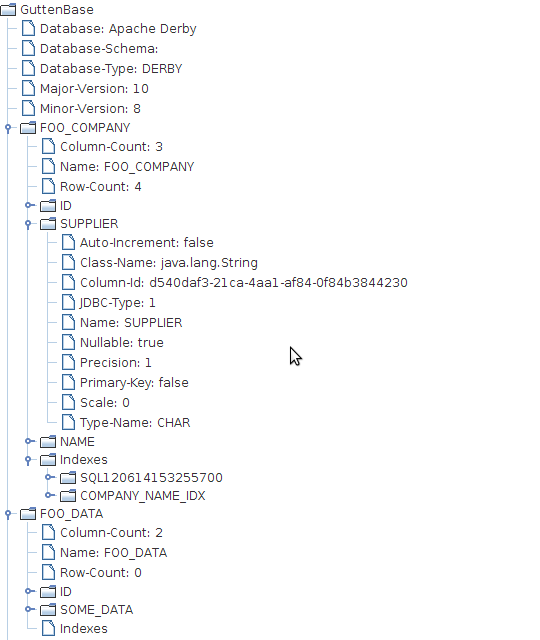

# Export/Import Dump

You may copy a data base to a special ZIP/JAR file. Afterwards you can use this file to import the data into some real data base. This is realized via special connectors. You could however implement your own dump format, too.

One cool feature is that you can specify a class that is used as the value of the Main-Class: attribute in the META-INF/MANIFEST.MF of the generated JAR file. I.e. you can execute the JAR file using your own code. By default, a simple viewer will be started.



## Code example

```java
connectorRepository.addConnectionInfo(CONNECTOR_ID1, new MySqlConnectionInfo())
  .addConnectionInfo(CONNECTOR_ID2, new PostgresqlConnectionInfo())
  .addConnectionInfo(EXPORT, new ExportDumpConnectorInfo(CONNECTOR_ID1, DATA_JAR))
  .addConnectionInfo(IMPORT, new ImportDumpConnectionInfo(DATA_JAR));
...
// Export data to JAR
new DefaultTableCopyTool(_connectorRepository).copyTables(CONNECTOR_ID1, EXPORT);
...
// Import data from JAR
new DefaultTableCopyTool(_connectorRepository).copyTables(IMPORT, CONNECTOR_ID2);
```
